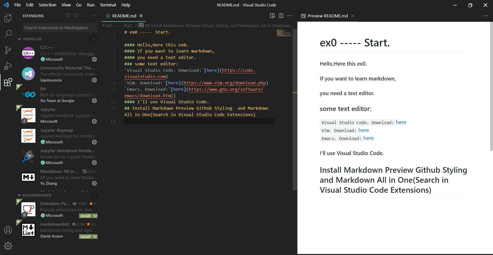

# ex0 ----- Start.

#### Hello,Here this ex0.
#### If you want to learn markdown,
#### you need a text editor.
### some text editor:
`Visual Studio Code. Download:`[here](https://code.visualstudio.com)  
`Vim. Download:`[here](https://www.vim.org/download.php)  
`Emacs. Download:`[here](https://www.gnu.org/software/emacs/download.html)  
#### I'll use Visual Studio Code.
## Install Markdown Preview Github Styling  and Markdown All in One(Search in Visual Studio Code Extensions)

# I'll see you at ex1.