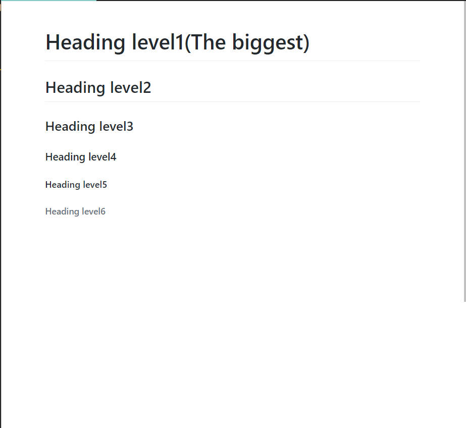

# ex1 ---   Title

## Hello,here's ex1
### here is the code you should type:
## CODE:
    # Heading level1(The biggest)
    ## Heading level2
    ### Heading level3
    #### Heading level4
    ##### Heading level5
    ###### Heading level6
##### (DON'T FORGET SPACE BAR)
## The code looks like this:

    