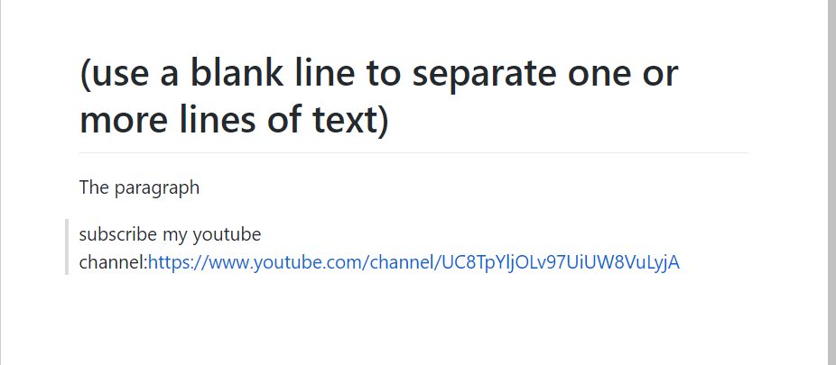

# ex2 --- Paragraph
## Hello,here is ex2
### This time I'll teach you how make a paragraph
## THe Code:
    (use a blank line to separate one or more lines of text)

    The paragraph
    subscribe my youtube channel:https://www.youtube.com/channel/UC8TpYljOLv97UiUW8VuLyjA

## The code will looks like this:

